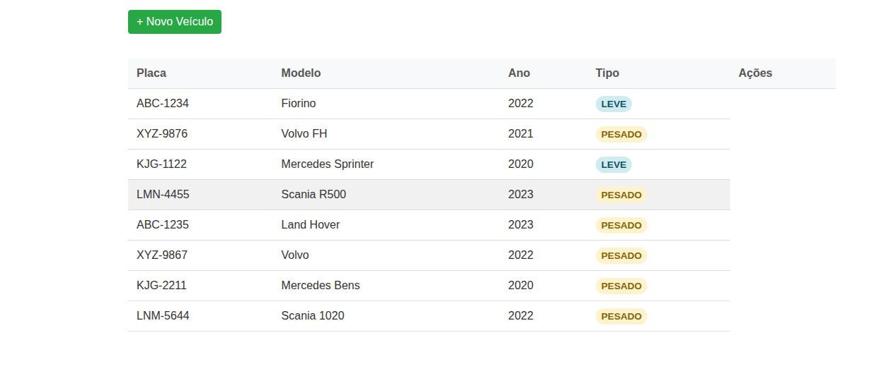
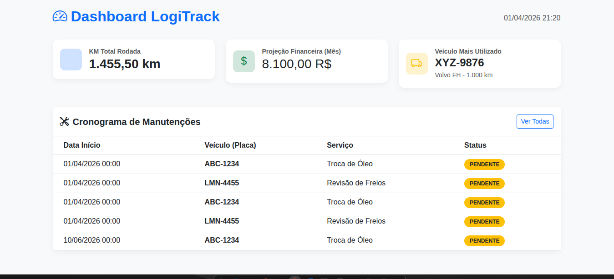
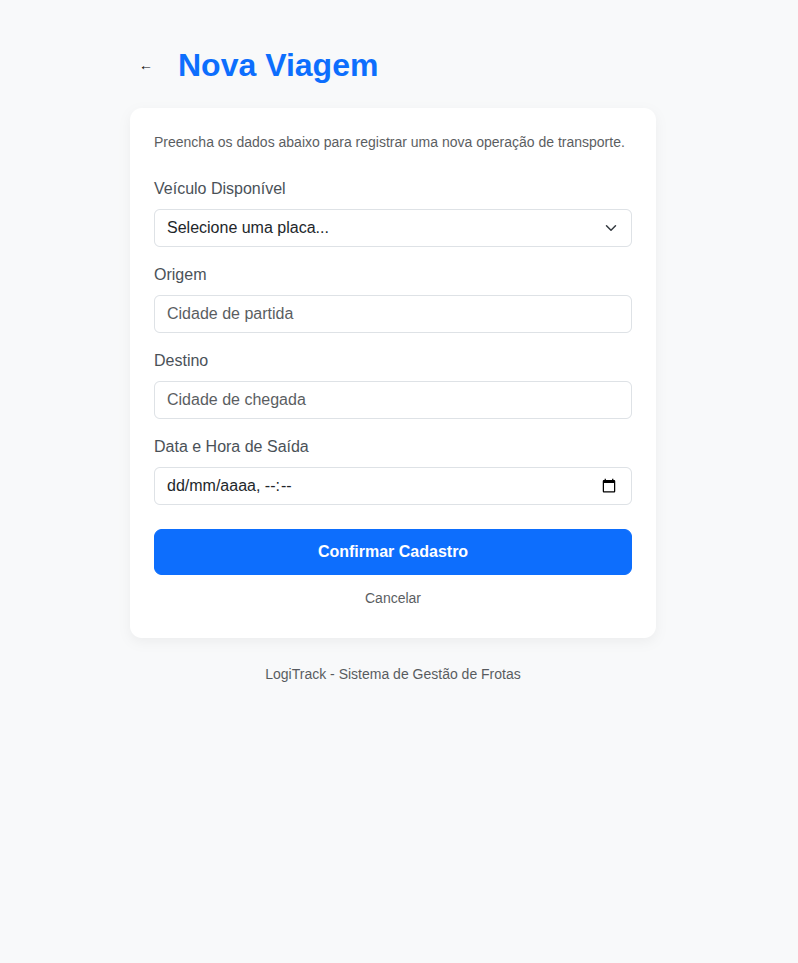

# LogiTrack Pro

<h5>Empresa fictícia do setor de logística e transportes que opera frotas para entregas interestaduais.
Este sistema fornece ao usuário uma leitura clara dos dados do sistema contribuindo na tomada de decisões de forma mais
consciente, além disso, moderniza a maneira como os dados são tratados e disponibiliza para o usuário uma interface
amigável contribuindo para uma leitura mais rápida e fluída, também fornece relatórios em um dashboard de análises. </h5>
-----------------------------------------------------------------------
## 🚀 Tecnologias

- Java 17
- Spring Boot
- Thymeleaf
- Docker
- PostgreSQL
-----------------------------------------------------------------------
## ⚙️ Como rodar

### Pré-requisitos
- Java 17
- Docker

### Passos

```bash
# Clonar o repositório
git clone https://github.com/marcellojoaquim/LogiTrack-Project.git

# Entrar na pasta
cd LogiTrack

# Subir com docker
docker-compose up -d

# Para inserir dados no banco, há um script no diretório: resources/db/
CargaInicial.sql
```

-----------------------------------------------------------------------
### 4. 📌 Funcionalidades

Lista os veículos cadastrados.
Insere viagens e Manutenções.
CRUD completo de viagens. 
Gera os seguintes relatórios:
- KM Total Rodada pela frota.
- Projeção Financeira baseada em futuras manutenções.
- Veículo com maior quilometragem da frota.
- Cronograma de manutenções futuras.

-----------------------------------------------------------------------
## 📂 Estrutura

    src/
    ├── config/
    ├── controller/
    ├── exception/
    ├── service/
    ├── repository/
    ├── model/
    └── resources/
        ├── templates/
        └── db/
-----------------------------------------------------------------------
### Observações
As interfaces estarão disponíveis em:
- http://localhost:8081/veiculos para veículos
  

- http://localhost:8081/dashboard para leitura dos relatórios
  

- http://localhost:8081/viagens para gerar viagens

  
-----------------------------------------------------------------------
## 🧪 Testes

Para rodar os testes:

```bash
mvn test
```

## 👤 Autor

Feito por Marcello